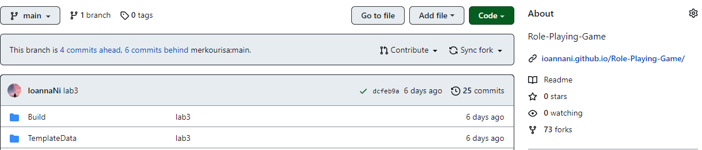

# Lesson: Digital & Serious Games

### First and Last Name: Νίνου Ιωάννα
### University Registration Number: dpsd19085
### GitHub Personal Profile: https://github.com/IoannaNi
### Digital & Serious Games Personal Repository: https://github.com/IoannaNi/Role-Playing-Game

# Introduction

# Summary

# 1st Deliverable
Για την εκτέλεση του ψηφιακού παιχνιδιού ακολούθησαν κάποια βήματα . 
Αρχικά σύνδεσα το link μου με το αρχείο και την αναφορά του παιχνιδιού.

 Ύστερα σχεδίασα τα δικά μου assets που θα χρησιμοποιήσω για το παιχνίδι. Ζωγράφισα δυο ήρωες την “Pink” και τον “Jo”, τη φιγούρα να περπατάει, να στέκετε ,να επιτίθεται με το “όπλο”του, να πηδάει και να μεταμφιέζεται όταν κερδίζει την πίστα . Έπειτα σχεδίασα τον στόχο του ήρωα που είναι μπαλόνια , τα οποία προσπαθεί ο χρήστης να τα σκάσει.
Αφού άνοιξα ένα νέο αρχείο 2D παιχνιδιού το Unity, πέρασα την εικόνα  του ήρωα του παιχνιδιού, σαν assets.

 Έκοψα την συγκεκριμένη εικόνα και έφτιαξα μια μια κίνηση ξεχωριστά. Ρυθμίζοντας στο το "Sprite Mode" ως  "Multiple" και επειτα πήγα να το επεξεργαστώ.

Αφού ετοίμασα τις εικόνες από τους ήρωες του παιχνιδιού , δημιούργησα  ένα script. Το script είναι ένας φάκελος όπου εκεί θα είναι τα αρχεία C , που θα υπάρχουν όλοι οι μετασχηματισμοί και όλες οι κινήσεις που θα υπάρχουν στο παιχνίδι, είτε για να κινείται η φιγούρα , είναι να εκτελεί άλλες εντολές . Συγκεκριμένα δημιούργησα ένα αρχείο που το ονόμασα Controller και το πέρασα σαν ιδιότητα του παίκτη , με αποτέλεσμα η φιγούρα να κινείται με συγκεκριμένα πλήκτρα(πάνω-κάτω-δεξιά-αριστερά). 

Υστερα δημιοόυργησα τα εξης:
Ενα φακελο "Grid" οπου ορισα το πάτωμα σε αυτό.
Mεσα στα assets μου tiles, αφου εφτιαξα την πιστα μου κατέβασα απο το ιντερνετ εικονες με δίαφορα αντικειμενα για το DEcoretion της πιστας.  

# 2nd Deliverable

   1. Δημιουργία συγκρούσεων του πρωταγωνιστή.
     Για να δημουργήσω συγκρούσεις του πρωταγωνιστή έτσι ώστε να μην περνάει μέσα από τα διάφορα αντικείμενα χρειάστηκε να του προσθέσω καποια στοιχεία όπως είναι:

       -Το "Rigidvody 2D", για να έχει ο παίκτης φυσική υπόσταση(βαρύτητα, δύναμη , τριβή). Όρισα την ιδιότητα Gravity Scale σε 0 για να μην πέφτει το σώμα προς τα κάτω λόγο βαρύτητας. Ενεργοποιήσα το πλαίσιο ελέγχου Freeze Rotation του παίκτη για να μην περιστρέφεται όταν συγκρούεται με ένα αντικείμενο. 
       -Το "Box Collider 2D", με αυτό ορίζω στον παίκτη μου ένα πλαίσιο, όπως και στα αντικείμενα που θέλω να συγκρούεται. Έτσι θα έχουν "φυσικό σώμα".
     Έπειτα, έκανα κάποιες αλλαγές στον κώδικα στον "pinkController" με βάση το tutorial.

 2. Προσθήκης αντικειμένων που θα δίνουν ζωή στον παίκτη. 
 Αρχικά έκανα κάποιες αλλαγές στον κώδικα του παίκτη.

# 3rd Deliverable 

# Conclusions

# Sources
