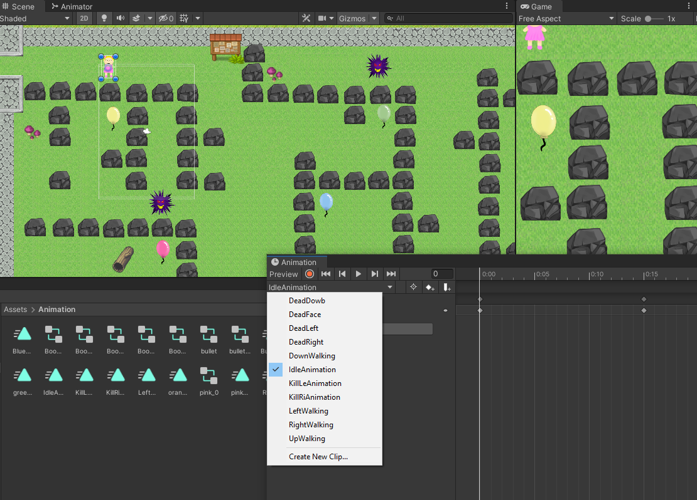
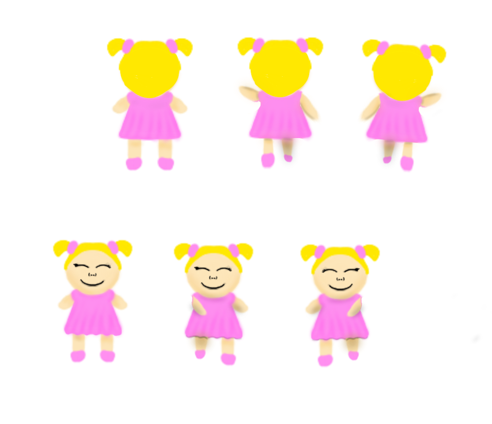

# Lesson: Digital & Serious Games

### First and Last Name: Νίνου Ιωάννα
### University Registration Number: dpsd19085
### GitHub Personal Profile: https://github.com/IoannaNi
### Digital & Serious Games Personal Repository: https://github.com/IoannaNi/Role-Playing-Game

# Introduction

# Summary

# 1st Deliverable
Για την εκτέλεση του ψηφιακού παιχνιδιού ακολούθησαν κάποια βήματα . 
Αρχικά σύνδεσα το link μου με το αρχείο και την αναφορά του παιχνιδιού.

 Ύστερα σχεδίασα τα δικά μου assets που θα χρησιμοποιήσω για το παιχνίδι. Ζωγράφισα δυο ήρωες την “Pink” και τον “Jo”, τη φιγούρα να περπατάει, να στέκετε ,να επιτίθεται με το “όπλο”του, να πηδάει και να μεταμφιέζεται όταν κερδίζει την πίστα . Έπειτα σχεδίασα τον στόχο του ήρωα που είναι μπαλόνια , τα οποία προσπαθεί ο χρήστης να τα σκάσει.
Αφού άνοιξα ένα νέο αρχείο 2D παιχνιδιού το Unity, πέρασα την εικόνα  του ήρωα του παιχνιδιού, σαν assets.

 Έκοψα την συγκεκριμένη εικόνα και έφτιαξα μια μια κίνηση ξεχωριστά. Ρυθμίζοντας στο το "Sprite Mode" ως  "Multiple" και επειτα πήγα να το επεξεργαστώ.

Αφού ετοίμασα τις εικόνες από τους ήρωες του παιχνιδιού , δημιούργησα  ένα script. Το script είναι ένας φάκελος όπου εκεί θα είναι τα αρχεία C , που θα υπάρχουν όλοι οι μετασχηματισμοί και όλες οι κινήσεις που θα υπάρχουν στο παιχνίδι, είτε για να κινείται η φιγούρα , είναι να εκτελεί άλλες εντολές . Συγκεκριμένα δημιούργησα ένα αρχείο που το ονόμασα Controller και το πέρασα σαν ιδιότητα του παίκτη , με αποτέλεσμα η φιγούρα να κινείται με συγκεκριμένα πλήκτρα(πάνω-κάτω-δεξιά-αριστερά). 

Υστερα δημιοόυργησα τα εξης:
Ενα φακελο "Grid" οπου ορισα το πάτωμα σε αυτό.
Mεσα στα assets μου tiles, αφου εφτιαξα την πιστα μου κατέβασα απο το ιντερνετ εικονες με δίαφορα αντικειμενα για το DEcoretion της πιστας.  

# 2nd Deliverable

  

  **1. Δημιουργία συγκρούσεων του πρωταγωνιστή**
        
        Αρχικά πρόσθεσα κάποια αντικείμενα που είναι σαν εμπόδια. Τα οποία είναι:
         βραχάκια , τοίχος , μπαλόνια , λίμνη , δέντρα  μανιτάρια , πίνακα ενημερώσεων,  φυτά και ξύλα. 
         Στην συνέχεια τα μετέτρεψα  σε Prefab για να μπορώ να τα ξανα χρησιμοποιήσω.
  

        Για να δημουργήσω συγκρούσεις του πρωταγωνιστή με τα αντικείμενα, 
        δηλαδή να μην περνάει μέσα από τα διάφορα 
        αντικείμενα χρειάστηκε να του προσθέσω καποια στοιχεία όπως είναι:
  
          -Το **"Rigidody 2D"**, για να έχει ο παίκτης φυσική υπόσταση(βαρύτητα, δύναμη , τριβή). 
           Όρισα την ιδιότητα Gravity Scale σε 0 για να μην πέφτει το σώμα προς τα κάτω λόγο βαρύτητας.
           Ενεργοποιήσα το πλαίσιο ελέγχου Freeze Rotation του παίκτη για να μην περιστρέφεται
           όταν συγκρούεται με ένα αντικείμενο. 
          -Το **"Box Collider 2D"**, με αυτό ορίζω στον παίκτη μου ένα πλαίσιο, 
          όπως και στα αντικείμενα που θέλω να συγκρούεται. 
          Έτσι θα έχουν "φυσικό σώμα".
          Έπειτα, έκανα κάποιες αλλαγές στον κώδικα στον "pinkController" με βάση το tutorial.

  

        Με τις πραραπάνω ιδιότητες οριοθέτησα και την πίστα μου, 
        έτσι ώστε να μην μπορεί ο παίκτης να βγεί από την πίστα.
        Πρόσθεσα ένα game object που το ονόμασα "floorCol", στο οποιό έβαλα τέσσερης
        box colliders στο σχήμα της πίστας όπως φαίνεται και στην  παρακάτω εικόνα.
         
  

 
   **2. Προσθήκης αντικειμένων που θα δίνουν ζωή στον παίκτη.**

      Αρχικά πρόσθεσα αντικείμενα που θα παίρνει ζωή ο παίκτης μου, τα οποία είναι μπαλόνια, τα οποία μπαλόνια τα σχεδίασα μόνη μου.
      Έπειτα, έκανα κάποιες αλλαγές στον κώδικα του παίκτη, έτσι ώστε με το που πάει να το πίασει παίρνει μια ζωη και το μπαλόνι εξαφανίζεται. 
      Όρισα στα μπαλόνια τις παρακάτω ιδιότητες για να μπορει ο παίκτης να 
      το πιάνει και να μην συκρούεται. 

 
  

   **3. Προσθήκη εχθρού - Damage Zone**
      
      Αφού σχεδίασα τον εχθρό μου και έβαλα τα συγκεκριμένα αντικείμενα,
      στα οποία αν πατήσει εκεί ο παίκτης χάνει ζωή. 
      Τα αντικείμενα που χάνει ζωή ο παίκτης είναι τα μανιτάρια και η  λίμνη. 
      Στον εχθρό έφτιαξα ενα script με βάση το tutorial, όπως και σε αυτόν έβαλα κάποιες ιδιότητες.

  

   **4. Sprite Animation**
      Έχω κάνει τα animation των αντικειμένων. Του παίκτη,να μένει στάσιμος , να προχωράει δεξιά-αριστερά, πάνω κάτω , να τραυματίζεται και να βγάζει το σφυρί.
      Τα μπαλόνια, να σκάνε.
      Τέλος του εχθρού που ανοιγοκλείνει το στόμα του, να τραγματίζεται και της σφαίρας.
      Τα σχέδια των αντικειμένων είναι σχεδιασμένα απο προς μια κατεύθηνση, για να δημιουργήσω animation του ίδιου σχεδίου αλλα με διαφορετική κατεύθηνση χρησιμοποιήσα την ιδιότητα "Flip". 

  
   
       
       
        
  **FlipAnomation**
       

  **Animator** : Το επόμενο βήμα είναι η δημιουργία Animator, το οποίο συνδέει τα animation με τα skript και την σειρά που πραγματοποιούντε.
   Με βάση το tutorial έκανα τις παρακάτω κινήσεις.
  Συνοπτικά , για τον παίκτη, έφτιαξα 3 blend tree, το Movement("κινείται"),το Dead("τραυματίζεται") και το FireFire("πυροβολεί").
   Στην συνέχεια τα σύνδεσα ("make transitions") και τους έθεσα κάποιους παραμέτρους όπως φαίνονται και στην εικόνα.

  
  
  
  
       
  **5. Projectile** 

    Με βάση το tutorial άλλαξα τους κώδικες του Bullet , player και του enemy. 
    Έβαλα collider στην σφαίρα. 
    Έπειτα έβαλα layers, κυρίως για να μην βρίσκουν οι colliders του παίκτη με τον collider της σφαίρας. 

**6. Camera** 
   Για να ακολουθεί η κάμερα τον παίκτη πρόσθεσα ένα skript "CameraFollow", το  οποίο το βρήκα απο ένα tutorial στο youtube ( https://www.youtube.com/watch?v=FXqwunFQuao ).

  

# 3rd Deliverable 

# Conclusions

**Κυρίως μενού (σχεδιασμένο από εμένα):**

**Βασικός Παίκτης(σχεδιασμένο από εμένα):**

**Εχθρός(σχεδιασμένο από εμένα):**

**Ζωές (σχεδιασμένο από εμένα):**

**Πληροφορίες  (σχεδιασμένο από εμένα):**
Πατώντας το "x" 
.png)

**Πόντοι:**

**Health Bar (σχεδιασμένο από εμένα):**

**Σφαίρα (σχεδιασμένο από εμένα):**
Πατώντας το "Ctrl" or "Clik"

**Τηλεμεταφορά (σχεδιασμένο από εμένα):** 
Πατώντας το "t" 

# Sources
https://www.youtube.com/watch?v=FXqwunFQuao